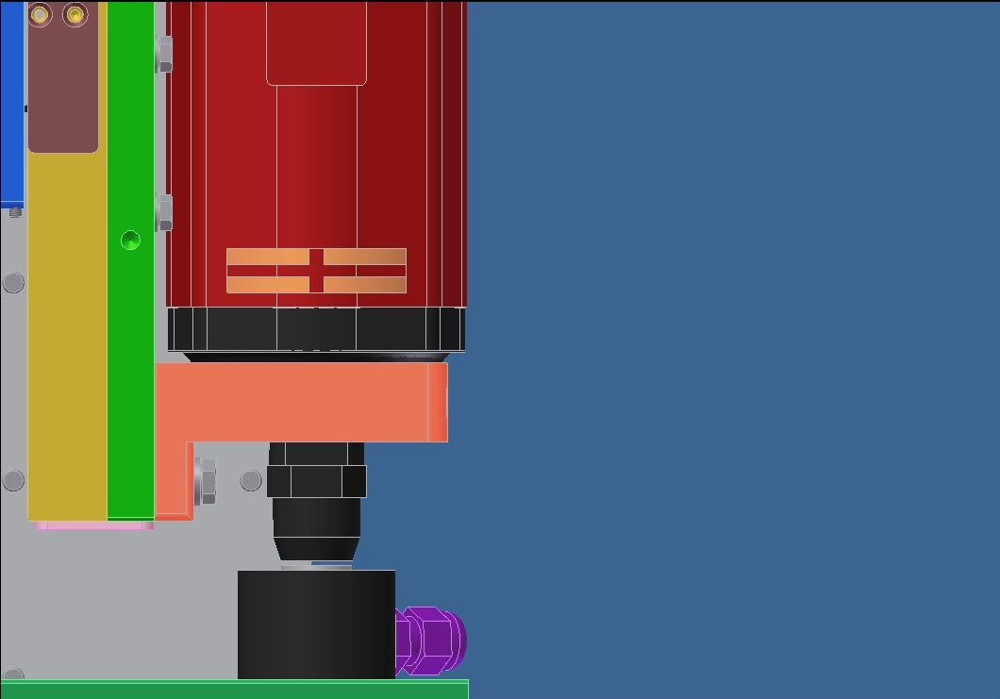
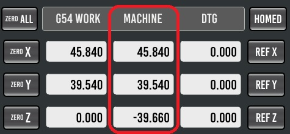
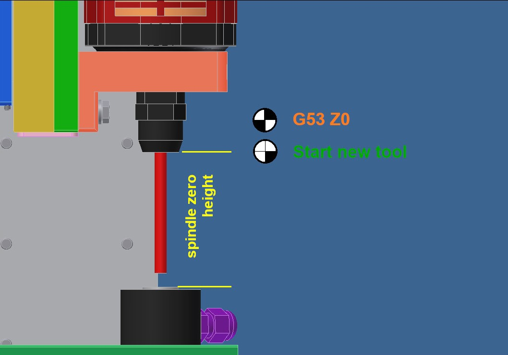
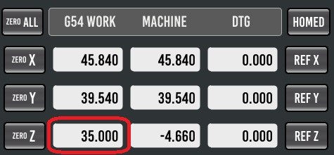
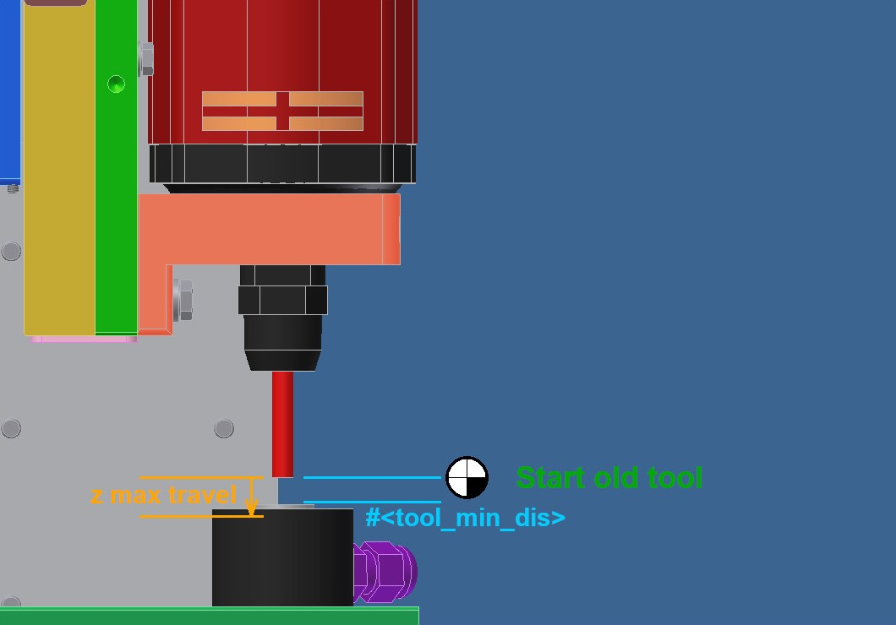

# Erklärung zur Nutzung der Werkzeugvermessungsroutine für Probe Basic von TooTall18T .
Version 5.0.0 stand 10.12.2024  
https://github.com/TooTall18T/tool_length_probe

> [!IMPORTANT]
> Die Benutzung der Subroutinen geschieht auf eigene Gefahr!

> [!NOTE]
> Bis zur Probe Basic Version 0.5.4-stable muss die Version 4.0.1 dieser Routine genutzt werden.
> Ab Version 0.6.0 von Probe Basic oder einer anderen GUI wird die Version 5.0.0 oder höher dieser Routine benötigt.

---
## Inhalt
- Anmerkungen und Hinweise
- Installation
- Einrichten
    - Grundeinstellung
- Ablauf der Routine
    - Weitere Funktionen
- Weitere Informationen

---
## Anmerkungen und Hinweise
> [!NOTE]
> Die Routinen wurden mit den Versionen LinuxCNC 2.9.3 und Probe Basic 0.6.0-18 getestet.
> Bei anderen Versionsständen können unter Umständen Unterschiede im Ablauf statt finden.

> [!IMPORTANT]
> Die Funktionen der Routine sollten mit verminderter Geschwindigkeit getestet werden, bevor die Routine im Fertigungseinsatz genutzt wird.

> [!NOTE]
> Bei Angaben wie "**{spindel zero}**" handelt es sich um Eingabefelder in Probe Basic.

> [!NOTE]
> Bei Angaben wie "**[TOOL]**" handelt es sich um Schaltflächen oder Menüs in der Oberfläche von Probe Basic.

> [!NOTE]
> Bei Angaben wie "**#<tool_min_dis>**" handelt es sich um Variablen aus der Routine. Diese müssen ggf. am Anfang der Routine unter "-1- Fixed parameters" angepasst werden.

---
## Installation
Dateien die ausgetauscht und/oder bearbeitet werden vorher sichern.  
Zur Nutzung der Vermessungsroutine wird nur die Datei "tool_touch_off.ngc" benötigt.  
Alle anderen Dateien sind optional.  

In der ".ini" unter "[EMCIO]" folgende Einträge ergänzen:  
TOOL_CHANGE_AT_G30 = 0			(Prevent the machine from moving to the G30-position when using the M6-command.)  
TOOL_CHANGE_QUILL_UP = 0		(Prevent the machine from moving the z-axis to G53 Z0-position when using the M6-command.)  

Die folgen Zeile in der ".ini" unter "[EMCIO]" löschen oder auskommentieren:  
TOOL_CHANGE_POSITION = ......

Datei(en) in den Ordner kopieren der in der ".ini" unter "[RS274NGS]" "SUBROUTINE_PATH" eingetragen ist (subroutines).  
In der ".var" Datei, welche in der ".ini" unter "PARAMETER_FILE" hinterlegt ist, prüfen 
ob der folgende Parameter genutzt wird:
2000

Sollte dieser genutzt werden, einen Anderen freien zwischen 31 und 2999 wählen und in den
Dateien der Routine ändern (#2000).  
Der Parameter muss nicht in die Parameterdatei eingetragen werden.

### Optionale Subroutinen
- go_to_g30.ngc -- Die original Routine fährt alle Achsen gleichzeitig auf die G30-Position. Diese Routine fährt die Z-Achse frei und danach zunächst die X- und Y-Achse an die G30-Position. Dort angekommen wird auch die Z-Achse auf die G30-Position gefahren.
> [!NOTE]
> Die G30-Position kann als Werkzeugwechselposition genutzt werden. Sollte dies nicht gewünscht sein, den Parameter "#<disable_pre_pos>" auf "1" setzen.
  
- M600.ngc -- Subroutine zum Aufruf der Werkzeugvermessung Automatikmodus (mit Werkzeugwechsel) aus dem CNC Programm heraus.  
	In der ".ini" unter "[RS274NGS]" folgendes eintragen:  
	REMAP=M600 modalgroup=6 ngc=m600
> [!IMPORTANT]
> Ein remap auf "M6" ist nicht zu empfehlen, da der M6-Befehl an verschiedenen Stellen in Probe Basic genutzt wird und es so zu nicht vorhersehbaren Ereignissen führen kann.

- M601.ngc -- Subroutine zum Aufruf der Werkzeugvermessung Manuellermodus (ohne Werkzeugwechsel) aus dem CNC Programm heraus oder für die Verwendung bei anderen GUIs.  
	In der ".ini" unter "[RS274NGS]" folgendes eintragen:  
	REMAP=M601 modalgroup=6 ngc=m601
> [!IMPORTANT]
> Ein remap auf "M6" ist nicht zu empfehlen, da der M6-Befehl an verschiedenen Stellen in Probe Basic genutzt wird und es so zu nicht vorhersehbaren Ereignissen führen kann.

- M300.ngc -- Subroutine zum Starten einer Werkzeugspindel ohne Rückmeldung. Das CNC Programm pausiert nach dem Start der Spindel für eine einstellbare Zeit (P4.0 = 4s). Die Zeit wird in der Routine eingetragen.    
	In der ".ini" unter "[RS274NGS]" folgendes eintragen:  
	REMAP=M300 modalgroup=7 ngc=m300

- M500.ngc -- Subroutine zum Stoppen einer Werkzeugspindel ohne Rückmeldung. Wenn die Spindel an war, pausiert das CNC Programm für eine einstellbare Zeit (P4.0 = 4s). Die Zeit wird in der Routine eingetragen.  
	In der ".ini" unter "[RS274NGS]" folgendes eintragen:  
	REMAP=M500 modalgroup=7 ngc=m500
	
---
## Einrichten

### Grundeinstellung
1. Die Subroutine in einem Editor öffnen.
2. Werkzeug aus der Spindel entfernen.
3. Werkzeug auf "0" umschalten.
4. Verschiebung des Werkstückkoordinatensystems zurücksetzen (G5X = G53). 
5. Die Spindel zentrisch über dem Werkzeugtaster positionieren.  
6. Die Spindel knapp über dem Schaltpunkt des Werkzeugtasters positionieren.  
  
7. Die G53-Koordinaten ablesen und in der Subroutine unter "-1- Fixed parameters" / "-MAIN-" / "#<tool_touch_x_coords>", "#<tool_touch_y_coords>" und "#<tool_touch_z_coords>" eintragen.  
  
8. Z-Achse nullen.
9. Z-Achse hoch fahren. Abstand zwischen Längentaster und Spindel so groß wählen, dass das längste Werkzeug mit Abstand dazwischen passt. Diese Position dient als Startpunkt für die Vermessung von neuen Werkzeugen. Die Z-Position aus dem akuellen Koordinatensystem unter [PROBING] [TOOL SETTER] "{spindle zero}" eintragen. Der Wert kann jederzeit geändert werden.  
  
  

Für Prob Basic unter [PROBING] [TOOL SETTER] die folgenden Parameter ausfüllen:
Für andere GUIs die Parameter in der Routine ausfüllen. Die Parameter #3004-#3013 überschreiben:
| Parameter | Beschreibung  |
| -------  | -----  |
| fast probe fr  | Geschwindigkeit in Maschineneinheit/min für die erste Antastung (schnelle Vermessung). |
| slow probe fr  | Geschwindigkeit in Maschineneinheit/min für die zweite Antastung. Ist der Wert 0 , wird nur die erste Antastung durchgeführt. |
| traverse fr | Geschwindigkeit in Maschineneinheit/min für schnelle Bewegungen wärend des Prozesses. |
| z max travel  | Maximale Strecke die die Z-Achse während der Vermessung eines bekannten Werkzeugs zurücklegt. Wert sollte größer als "#<tool_min_dis>" sein. |
| spindle zero  | Abstand zwischen Spindel und Werkzeugtaster für Neuvermessungen. |
| retract dist  | Strecke die die Z-Achse nach der ersten Antastung nach oben fährt bevor die zweite Antastung stattfindet. Es muss ein Wert eingetragen sein, egal ob die langsame Vermessung stattfindet oder nicht. |
| tool offset direction | Zur Vermessung von Werkzeugen mit großen Durchmessern. Richtung des Werkzeugversatzes. 0=X- 1=X+ 2=Y- 3=Y+ |

Bei Probe Basic: Nachdem die Parameter ausgefüllt sind [UPDATE TOOL SETTER PARAMETERS] drücken, um die Parameter in der Variablendatei zu speichern. 

  

In der Datei "tool_touch_off.ngc" die folgenden Parameter unter "-1- Fixed parameters" anpassen:
| Parameter | Beschreibung  |
| -------  | -----  |
| `ALLGEMEIN` | |
| #<debug_mode>  | Hier wird der Debugmode zur Fehlersuche eingestellt. 0=AUS, 1=Logdatei . Datei "logfile.txt" im Konfigurationsordner der Maschine. Die Datei wird jedes mal überschrieben. |
| #<use_tool_table>  | Bei "1" wird die Werkzeugtabelle genutzt und bei einem bekannten Werkzeug (Länge >0) das Werkzeug für die Vermessung tiefer positioniert. |
| #<tool_min_dis>  | Abstand zwischen Werkzeugtaster und alter Länge des Werkzeugs. Nur in Verbindung mit Werkzeugtabelle genutzt. Wert sollte kleiner als "{z max travel}" sein. |
|   |   |
|  `OPTION: ALLGMEIN` | |
| #<brake_after_M600>  | Bei ">0" warten auf Bestätigung, dass das Programm nach der Vermessung weiter arbeiten darf. 1 = M00, 2 = M01 . Siehe "Fall 2.1 und 2.2" |
| #<go_back_to_start_pos>  | Bei "1" fährt die Maschine, bei der Automatischen Vermessung, zur Position zurück an der die Routine gestartet wurde. |
| #<spindle_stop_m>  | M-Befehlnummer zum stoppen der Spindel. Standard 5 (M5), optional 500 (M500 / m500.ngc). |
| #<disable_pre_pos> | Deaktiviert die Werkzeugwechselposition an der G30-Koordinaten. Werkzeug wird über Werkzeugtaster gewechselt. |
| #< addreps> | Anzahl zusätzlicher Vermessungsversuche. Bei fehlerhafter schneller Vermessung fährt die Maschine wieder an die Werkzeugwechselposition und das Werkzeug kann neu eingestellt werden. |
| #< lasttry> | Bei "1" macht die Maschine beim letzten Vermessungsversuch eine Vermessung ohne Werkzeugtabelle. #< addreps> muss mindestens "1" sein. |
|  |  |
|  `OPTION: WERKZEUGVERSATZ` | Zur Vermessung von Werkzeugen mit großen Durchmessern. |
| #<offset_diameter> | Durchmesser ab dem das Werkzeug versetzt werden soll. 0 = AUS |
| #<offset_value> | Werkzeugversatz in Prozent. |
|  |  |
|  `OPTION: 3D-TASTER` | Alternative Vermessungsposition für 3D-/Kantentaster. |
| #<finder_number> | Werkzeugnummer für Taster. |
| #<finder_touch_x_coords> | Absolute (G53) X-Koordinate für Messpunkt 3D-/Kantentaster. |
| #<finder_touch_y_coords> | Absolute (G53) Y-Koordinate für Messpunkt 3D-/Kantentaster. |
| #<finder_diff_z> | Differenz zwischen Werkzeugtaster und Referenzoberfläche. Das Vorzeichen gibt die Differenz in Achsrichtung an. "-" = tiefer als Werkzeugtaster, "+" = höher als Werkzeugtaster. |

> [!IMPORTANT]
> Bei den ersten Vermessungen sollte die Maschinengeschwindigkeit verringert werden um ggf. bei fehlerhaften Einstellungen nichts zu beschädigen.

> [!NOTE]
> Die Texte der Melde- und Warnfenster, die durch die Routine erzeugt werden, können in der "tool_touch_off.ngc" auf Deutsch umgestellt werden.
> Hierzu in der Routine nach "(DEBUG", und "(ABORT" suchen und das Semikolon ";" versetzen. ))

---
## Ablauf der Routine

### 1 Ablauf der Subroutine bei manueller Vermessung über [TOUCH OFF CURRENT TOOL] oder M601
Die Subroutine unterscheidet beim Aufruf zwei Fälle: neues Werkzeug (Länge <=0mm), bekanntes Werkzeug (Länge >0mm).

#### Fall 1.1 und 1.2:
Die Z-Achse fährt auf Maschinen Nullpunkt hoch und schaltet ggf. die Spindel aus (über "#<spindle_stop_m>" Stoppfunktion wählbar). Anschließend fährt die Maschine zum Werkzeugtaster.
Über den festen Parameter "#<use_tool_table>" kann gewählt werden, ob die Werkzeugtabelle genutzt wird (1). Wird die Werkzeugtabelle nicht genutzt (0), macht die Maschine immer eine "Neuvermessung" (Fall 1.1).  
Fortfahrend mit Fall 1.1 oder 1.2 .

#### Fall 1.1 neues Werkzeug (Länge <=0mm):
Die Z-Achse fährt mit der Geschwindigkeit "{traverse fr}" auf die Höhe von "{spindle zero}" über den Werkzeugtaster.  
Dieser Wert muss größer sein als das längste zuerwartende Werkzeug, darf aber nicht länger sein als der Weg zwischen Werkzeugtaster und Z-Null.
Anschließend fährt die Z-Achse mit der Geschwindigkeit "{fast probe fr}" solange runter bis der Werkzeugtaster schaltet oder die Z-Achse die Strecke "{spindel zero}" abgefahren hat.  
Letzteres führt zu einer Fehlermeldung: "Tool length offset probe failed!" / "Werkzeugvermessung fehlgeschlagen!"  
Wenn der Taster geschaltet hat, fährt die Z-Achse um den Wert "{retract dist}" nach oben.  
Ist eine Geschwindigkeit für "{slow probe fr}" (>0) definiert, fährt die Maschine den Taster nochmal mit dieser Geschwindigkeit an. Sollte keine Geschwindigkeit definiert sein, wird dieser Schritt übersprungen.  
Danach fährt sich die Z-Achse auf Maschinen Nullpunkt frei.  
Die Maschine bleibt bei manueller Vermessung jetzt stehen.

#### Fall 1.2 bekanntes Werkzeug (Länge >0mm):
Wenn der Parameter "#<use_tool_table>" "1" ist, wird bei bekannten Werkzeugen (Länge >0mm) dieser Ablauf verwendet. Ansonsten wird der Fall 1.1 genutzt.  
Die Z-Achse fährt mit der Geschwindigkeit "{traverse fr}" das Werkzeug, ausgehend von der alten Werkzeuglänge, so hoch über den Taster wie es unter "#<tool_min_dis>" definiert ist.  
"#<tool_min_dis>" sollte nicht zu klein definiert werden, um Unterschiede beim Einlegen des Werkzeugs abfangen zu können.  
Anschließend fährt die Z-Achse mit der Geschwindigkeit "{fast probe fr}" solange runter bis der Werkzeugtaster schaltet oder die Z-Achse die Strecke "{z max travel}" abgefahren hat.  
Letzteres führt zu einer Fehlermeldung: "Tool length offset probe failed!" / "Werkzeugvermessung fehlgeschlagen!".  
"{z max travel}" sollte nicht zu groß gewählt werden, da sonst die Spindel auf den Taster fahren kann.  
Wenn der Taster geschaltet hat, fährt die Z-Achse um den Wert "{retract dist}" nach oben.  
Ist eine Geschwindigkeit für "{slow probe fr}" (>0) definiert, fährt die Maschine den Taster
nochmal mit dieser Geschwindigkeit an. Sollte keine Geschwindigkeit definiert sein, wird dieser Schritt übersprungen.  
Danach fährt sich die Z-Achse auf Maschinen Nullpunkt frei.  
Die Maschine bleibt bei manueller Vermessung jetzt stehen.

### 2 Ablauf der Subroutine bei Vermessung aus dem CNC Programm heraus (M600)  
Die Subroutine unterscheidet beim Aufruf vier Fälle: neues Werkzeug (Länge <=0mm), bekanntes Werkzeug (Länge >0mm), gleiches Werkzeug und Wechsel auf "T0" .

#### Fall 2.1 und 2.2:
Die Vermessung von neuen und bekannten Werkzeugen funktioniert in der Vermessung, die durch das CNC Programm gestartet wird, gleich. Siehe dazu "Fall 1.1" und "Fall 1.2" oben.  
Jedoch fährt die Maschine an die Werkzeugwechselposition (G30 oder über den Werkzeugtaster) und verlangt dort den Werkzeugwechsel bevor die Maschine zum Werkzeugtaster fährt. Sie dazu "Werkzeugwechselposition".  
Zusätzlich kann in der Routine über den festen Parameter "#<go_back_to_start_pos>" (1) gewählt werden, dass die Maschine nach der Vermessung an den Punkt zurück fährt an dem die Routine aufgerufen wurde. So muss man den Rückweg vom Taster nicht im CNC Programm programmieren.  
Fährt die Maschine, bedingt durch "#<go_back_to_start_pos>" zurück. Kann über "#<brake_after_M600>" (0/1/2) gewählt werden ob die Maschine an der Stelle wartet bevor
das CNC Programm weiter läuft.   
"0" macht keine Pause.  
"1" macht eine Pause mittels "M00" Befehl. Weiter fahren durch betätigen von [CYCLE START]  
"2" macht eine Pause mittels "M01" Befehl, wenn zusätzlich auf der Oberfläche [M01 BREAK] aktiv ist. Weiter fahren durch betätigen von [CYCLE START]

> [!WARNING]
> Die Subroutine startet die Spindel nicht neu!

#### Fall 2.3 gleiches Werkzeug:
Ist das gewählte Werkzeug bereits in der Maschine. Wird die Meldung "Same tool" / "Selbes Werkzeug" ausgegeben. Die Spindel wird nicht gestoppt.  
Über "#<brake_after_M600>" (0/1/2) kann gewählt werden ob die Maschine an der Stelle wartet bevor das CNC Programm weiter läuft.  
"0" macht keine Pause.  
"1" macht eine Pause mittels "M00" Befehl. Weiter fahren durch betätigen von [CYCLE START]  
"2" macht eine Pause mittels "M01" Befehl, wenn zusätzlich auf der Oberfläche [M01 BREAK] aktiv ist. Weiter fahren durch betätigen von [CYCLE START]

#### Fall 2.4 Wechsel auf T0 :
> [!WARNING]
> Ein Wechsel am Ende des CNC Programms mittels "M600 T0", kann bei Programmabbrüchen dazu führen, dass LinuxCNC von G43 auf G49 umschaltet!
> Wenn das Programm erneut gestartet wird, kann es sein, dass nicht wieder auf G43 umgeschaltet wird. Kollisionsgefahr!
> Der Fall dient nur dazu, dass nicht versehentlich mit Werkzeug "0" eine Vermessung gestartet wird.

### Weitere Funktionen

#### Debug Mode
Der Debug Mode erzeugt im Konfigurationsordner eine "logfile.txt" Datei. In dieser werden einige Parameter der Maschine und der Routine gespeichert um ggf. bei einem Fehler den Grund dafür zu finden. Die Datei wird bei jedem Aufruf der Routine überschrieben.

#### Werkzeugwechselposition
Die Werkzeugwechselposition (G30) kann über [PROBING] [TOOL SETTER] [SET TOOL TOUCH OFF POS] festgelegt werden.  
Dazu die Maschine an die gewünschte Position fahren und [SET TOOL TOUCH OFF POS] drücken. Die Position kann jederzeit wenn nötig geändert werden. Um die Position für die Subroutine frei zugeben, den Wert "#<disable_pre_pos>" auf "0" setzen.
Wird die Funktion genutzt, fährt die Maschine vor der Vermessung über "M600" zunächst an die X-, Y- und Z-Koordinate (G30) und verlangt den Werkzeugwechsel. Danach positioniert sich die Maschine erst über dem Werkzeugtaster.  
Wird bei genutzter Werkzeugtabelle die Anzahl zusätzlicher Vermessungsversuche ("#< addreps>") auf min. "1" gesetzt, fährt die Maschine, sowohl bei der manuellen als auch automatischen Vermessung, nach einem Fehlversuch der schnellen Vermessung, an diese Position und verlangt erneut nach dem Werkzeug.  
So kann das Werkzeug nach justiert werden.  
Wird die Option "Letzter Versuch" genutzt, fährt die Maschine beim letzten Vermessungsversuch nicht mehr die Werkzeugwechselposition an, sondern vermisst direkt das Werkzeug neu.

#### Zusätzliche Versuche
Sollte die Vermessung mit aktiver Werkzeugtabelle, Aufgrund eines kürzer eingesetzten Werkzeugs, bei der schnellen Vermessung fehlschlagen. Können über diesen Parameter zusätzliche Versuche hinzugefügt werden. So kann nach einem Fehlschlag ggf. das Werkzeug nach justiert werden oder in Verbindung mit der Funktion "Letzter Versuch" eine "Neuvermessung" gestartet werden.

#### Letzter Versuch
Für die Funktion "Letzter Versuch" muss "#< addreps>" mindestens auf "1" gesetzt sein.  
Sollten bis auf den letzten Versuch die Vermessungen fehlgeschlagen sein, kann über diese Funktion eine Neuvermessung statt finden.  
Wird bei genutzter Werkzeugtabelle "#< addreps>" und "#< lasttry>" jeweils auf "1" gesetzt und schlägt die schnelle Vermessung nach Fall 1.2 bzw. 2.2 fehl, macht die Maschine direkt eine "Neuvermessung" nach Fall 1.1 bzw. 2.1 .

#### Werkzeugversatz
Für Werkzeuge mit größerem Durchmesser kann über diese Funktion ein Mittenversatz erzeugt werden. Die Richtung in der dieser Versatz gefahren wird, wird über [PROBING] [TOOL SETTER] [TOOL OFFSET DIRECTION] festgelegt.

#### 3D-Taster
Sollte es nicht möglich sein einen 3D-/Kantentaster über den Werkzeugtaster zu vermessen. Kann eine alternative Vermessungsposition für diesen definiert werden. Die Höhendifferenz zwischen Vermessungsposition und Werkzeugtaster muss ermittelt werden und in "#<finder_diff_z>" eingetragen werden. Das Vorzeichen gibt die Differenz in Achsrichtung an. "-" = tiefer als Werkzeugtaster, "+" = höher als Werkzeugtaster.

---
## Weitere Informationen:
> [!NOTE]
> die Parameter "xy max travel", "tool diam probe" und "tool diam offset" werden in der Routine nicht verwendet.
