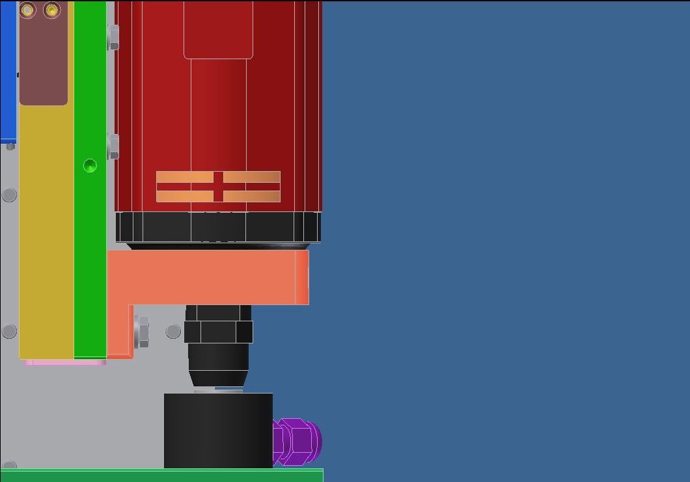
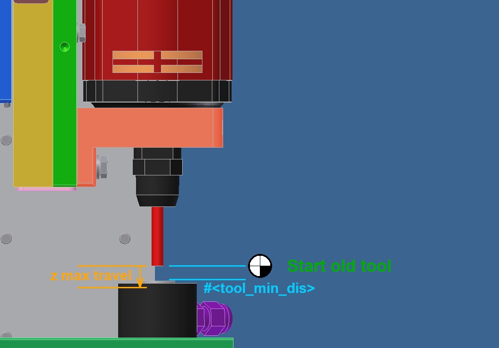

# Explanation of using the tool length probe subroutine for Probe Basic from TooTall18T .
Version 4.0.0 as of 18.01.2024  
https://github.com/TooTall18T/tool_length_probe

> [!IMPORTANT]
> Use the subroutines at your own risk!

> [!WARNING]
> The positioning above the touch probe has been changed! The values of version 3.0 can not be use!

> [!NOTE]
> The German version of this document is called "[anleitung.md](anleitung.md)" and it is in the same folder.

---
## Contents
- Notes and Notices
- Installation
- Set up
    - Main settings
- Flow of the routine
    - Further functions
- Further information

---
## Notes and Notices
> [!NOTE]
> The routines were tested with LinuxCNC 2.8 and Probe Basic 0.3.8 .
> With other versions, there may be differences in the process.

> [!IMPORTANT]
> The functions of the routine should be tested at reduced speed before using the routine in production.

> [!NOTE]
> Specifications such as "**{spindel zero}**" are input fields in Probe Basic.

> [!NOTE]
> Specifications such as "**[TOOL]**" are buttons or menus in Probe Basic.

> [!NOTE]
> Specifications such as "**#<tool_min_dis>**" are variables from the routine. These may have to be adjusted at the beginning of the routine at "-1- Fixed parameters".
---
## Installation
Back up files that are exchanged and/or edited beforehand.
Only the "tool_touch_off.ngc" file is required to use the measurement routine.
All other files are optional.

Enter the following in the ".ini" under "[EMCIO]":  
TOOL_CHANGE_AT_G30 = 0			(Prevent the machine from moving to the G30-position when using the M6-command.)  
TOOL_CHANGE_QUILL_UP = 0		(Prevent the machine from moving the z-axis to G53 Z0-position when using the M6-command.)  

Copy file(s) into the folder that is entered in the ".ini" under "[RS274NGS]" "SUBROUTINE_PATH" (subroutines).  
Enter the following parameters in the ".var" file, which is stored in the ".ini" under "PARAMETER_FILE":  
3000 0  
3001 0  
3002 0  
3003 0  
3004 0  
3005 0  
> [!IMPORTANT]
> All parameters must be in ascending order in the file.
> If the parameters are not entered or entered in the wrong order, the parameters from the user interface cannot be saved permanently for the subroutine.
> Should the parameters listed above already exist. Six other parameters must be chosen between 31 and 5000 and the routine rewritten.

### Optional subroutines:
- go_to_g30.ngc -- The original routine moves all axis at the same time to the G30-position. The new routine moves the z-axis free and than to the x and y coordinate of the G30-position. After that the z-axis moves to its position.

- M600.ngc -- Subroutine for calling tool measurement from the CNC program.  
Enter the following in the ".ini" under "[RS274NGS]":  
REMAP=M600 modalgroup=6 ngc=m600  
> [!IMPORTANT]
> A remap of "M6" is not recomended. The M6-command is used on different parts of Probe Basic and using a remap can leed to unforeseeable events.

- M300.ngc -- Subroutine to start a tool spindle without feedback. After the spindle has started, the CNC program pauses for an adjustable time (P4.0 = 4s).  
Enter the following in the ".ini" under "[RS274NGS]":  
REMAP=M300 modalgroup=7 ngc=m300  

- M500.ngc -- Subroutine to stop a tool spindle without feedback. If the spindle was on, the CNC program pauses for an adjustable time (P4.0 = 4s).  
Enter the following in the ".ini" under "[RS274NGS]":  
REMAP=M500 modalgroup=7 ngc=m500

---
## Set up

### Main settings
1. Open the subroutine in an editor.
2. Take out the tool.
3. Switch to tool "0".
4. Reset the workpiece coordinate system (G5X = G53).
5. Center the spindle over the tool probe.  
6. Position the spindle nose slightly above the trigger point of the tool probe.
  
7. Write the G53-coordinates into the subroutine at "-1- Fixed parameters" / "-MAIN-" / "#<tool_touch_x_coords>", "#<tool_touch_y_coords>" and "#<tool_touch_z_coords>"
  
8. Set the z-axis to zero.
9. Move the z-axis up. Choose a distance that the longest tool has some space to the tool touch probe. This position is the starting position for new tools. Write the z-position from the current coordinate system into [OFFSETS] "{spindle zero}". This value can be changed at any time.
  
  

Under [OFFSETS] fill in the following parameters:  
| Parameter | Description  |
| -------  | -----  |
| fast probe fr  | Speed in units/min for the first probe.  |
| slow probe fr  | Speed in units/min for the second probing. If the value is 0, only the first probing is carried out.  |
| z max travel  | Maximum distance travelled by the Z-axis during the measurement of a known tool. Value should be greater than "#<tool_min_dis>". |
| spindle zero  | Minimum distance between spindle and tool probe for new tools. |
| retract dist  | Distance that the Z-axis moves up after the first touch before the second touch takes place. A value must be entered, regardless of whether the slow measurement takes place or not. |

After the parameters are filled in press 1x [TOUCH OFF CURRENT TOOL] under [TOOL] to save the parameters in the variable file. No measurement is started. Only one message appears.  
> [!IMPORTANT]
> After changing the parameters, [TOUCH OFF CURRENT TOOL] must be pressed once again.  

  

Adjust the following parameters under "-2- Fixed parameters" in the "tool_touch_off.ngc" file:  
| Parameter | Description  |
| -------  | -----  |
| ` MAIN` |
| #<debug_mode>  | The debug mode for troubleshooting is set here. 0=OFF, 1=log file . File "logfile.txt" in the config folder of the machine. The file is overwritten each time. |
| #<use_tool_table>  | With "1" the tool table is used and with a known tool (length >0) the tool for the measurement is positioned lower.|
| #<tool_min_dis>  | Distance between tool probe and old tool length. Only used in connection with tool table.|
|  |  |
| ` OPTIONS: GENERALLY ` |
| #<brake_after_M600>  | If ">0" wait for confirmation that the program may continue to work after the measurement. 1 = M00, 2 = M01 . See "Case 1.2 and 2.2"|
| #<go_back_to_start_pos>  | With "1" the machine drives back to the position where the routine was started during automatic measurement.|
| #<spindle_stop_m>  | M-code number to stop the spindle. Default 5 (M5), optional 500 (M500/m500.ngc).|
| #<disable_pre_pos> | Disables the tool change position at the G30-coordinate. Tool will be changed above the tool probe. |
| #< addreps> | Number of extra repetitions. If fast probe failed, the machine moves back to the tool change position and the tool can be readjusted. |
| #< lasttry> | If "1" the machine do a probing at the last repetition without the tool table. #< addreps> must be min "1". |
|  |  |
| ` OPTIONS: TOOL DIAMETER ` |
| #<offset_diameter> | Tool diameter from when a offset should take place. 0=OFF |
| #<offset_direction> | Direction of the offset. 0=X+ 1=X- 2=Y+ 3=Y- |
| #<offset_value> | How much of the tool diameter should move in percent. |
|  |  |
| ` OPTIONS: TOOL EDGE-FINDER ` |
| #<finder_number> | Tool number of the edge-finder |
| #<finder_touch_x_coords> | Absolute (G53) x coordinate for the z reference position edge-finder |
| #<finder_touch_y_coords> | Absolute (G53) y coordinate for the z reference position edge-finder |
| #<finder_diff_z> | Difference between tool touch button and reference surface. |

> [!IMPORTANT]
> During the first measurements, the machine speed should be reduced in order not to damage anything in the event of incorrect settings.

> [!NOTE]
> The texts of the message and warning windows can be changed inside the "tool_touch_off.ngc" file into German.
> In case search for "(DEBUG", and "(ABORT" and switch the semicolon ";". ))

---
## Flow of the routine

### 1 Sequence of the sub-routine for manual measurement via [TOUCH OFF CURRENT TOOL]
When called, the subroutine differentiates between three cases: new parameters, new tool (length <=0mm), known tool (length >0mm) .  

#### Case 1.1 new parameters:  
If you have changed a parameter for tool measurement under [OFFSETS], you must press [TOUCH OFF CURRENT TOOL] once under [TOOL]. This saves the current parameters in the variable file. A measurement is not carried out, instead the message "New parameters saved!" appears.
In this way, the parameters do not have to be entered again manually in the M600 subroutine.

#### Case 1.2 and 1.3:  
The Z-axis moves up to the machine zero point, if necessary switches off the spindle (stop function selectable via "#<spindle_stop_m>") and then moves to the tool probe position.  
The fixed parameter "#<use_tool_table>" can be used to select whether the tool table is to be used (1). If the tool table is not used (0), the machine always makes one "remeasurement" (case 1.2).
Proceeding to case 1.2 or 1.3.

#### Case 1.2 new tool (length <=0mm):  
The Z-axis moves with G0 to the height above the tool probe, which is defined via "{spindle zero}".  
This value must be greater than the longest tool length to be expected, but less than the maximum way between touch probe and z-zero.
The Z-axis then moves down at the "{fast probe fr}" speed until the tool probe switches or the Z-axis has covered the "{spindle zero}" distance.  
The latter leads to an error message: "Tool length offset probe failed!"  
When the button has switched, the Z-axis moves up by the "{retract dist}" value.  
If a speed is defined for "{slow probe fr}" (>0), the machine approaches the probe again at this speed. If no speed is defined, this step is skipped.  
The Z-axis then moves to the machine zero point. 
The machine now stops during manual measurement.

#### Case 1.3 known tool (length >0mm):  
If the "#<use_tool_table>" parameter is "1", this sequence is used for known tools (length >0mm). Otherwise case 1.2 is used.  
Starting from the old tool length, the Z axis moves the tool with G0 as high over the probe as defined under "#<tool_min_dis>".  
"#<tool_min_dis>" should not be defined too small in order to be able to absorb differences when inserting the tool.  
The Z-axis then moves down at the "{fast probe fr}" speed until the tool probe switches or the Z-axis has covered the "{z max travel}" distance.  
The latter leads to an error message: "Tool length offset probe failed!"  
"{z max travel}" should not be chosen too large, otherwise the spindle can move onto the probe.  
If the touch probe has switched, the Z-axis moves up by the "{retract dist}" value. If a speed is defined for "{slow probe fr}" (>0), the machine moves the probe again at this speed.  
The Z-axis then moves to the machine zero point.  
The machine now stops during manual measurement.  

### 2 Sequence of the subroutine when measuring from the CNC program (M600)
When called, the subroutine differentiates between four cases: new tool (length <=0mm), known tool (length >0mm), same tool and change to "T0".

#### Case 2.1 and 2.2:  
The measurement of new and known tools works the same way in the measurement that is started by the CNC program. See "Case 1.2" and "Case 1.3" above.  
However, the machine moves to the tool change position (G30 or above the touch probe) and ask for the new tool before moving to the touch probe. See also "pre change position".  
In addition, you can use the fixed parameter "#<go_back_to_start_pos>" (1) in the routine to select that the machine, after the measurement, returns to the point where the routine was called. So you don't have to program the return path from the tool probe in the CNC program.  
Moves the machine back due to "#<go_back_to_start_pos>". Can be selected via "#<brake_after_M600>" (0/1/2) whether the machine waits at the point before
the CNC program continues to run.  
"0" does not pause.  
"1" pauses using "M00" command. Continue driving by pressing [CYCLE START]  
"2" makes a break using the "M01" command if [M01 BREAK] is also active in Probe Basic. Continue driving by pressing [CYCLE START]

> [!WARNING]
> The subroutine does not restart the spindle!

#### Case 2.3 same tool:  
Is the selected tool already in the machine. The message "Same tool" is output. The spindle would not be stopped.  
"#<brake_after_M600>" (0/1/2) can be used to select whether the machine waits at this point before the CNC program continues to run.  
"0" does not pause.  
"1" pauses using "M00" command. Continue driving by pressing [CYCLE START]  
"2" makes a break using the "M01" command if [M01 BREAK] is also active in Probe Basic. Continue driving by pressing [CYCLE START]

#### Case 2.4 Change to T0:  
> [!WARNING]
> A change at the end of the CNC program using "M600 T0" can cause LinuxCNC to switch from G43 to G49 if the program aborts!  
> If the program is restarted, it may not switch back to G43. Danger of collision!  
> The case only serves to ensure that a measurement is not accidentally started with tool "0".

### Further functions

#### Debug mode
The debug mode writes the "logfile.txt" file inside the configurations directory. In this file some machine and subroutines parameter will be saved to help with trouble shooting. The file will be overwritten every time.   

#### Pre change position
The tool change position (G30) can be set with [OFFSETS] [SET TOOL TOUCH OFF POSITION].  
To do this, move the machine to the desired position and press [SET TOOL TOUCH OFF POSITION]. This position can be changed at any time if needed. To use this position for the routine "#<disable_pre_pos>" must be set to "0".  
If this function will be used, the machine moves to the G30 X- and Y-coordinate in case of a measurement started with "M600" and asks there for the tool change.  
After that the machine moves to the touch probe position.  
When the tool table is used and the additional repetitions ("#< addreps>") is set to a min. of "1", the machine moves to this position after the fast measurement failed. This happens at the manual and automatic measurement.  
This will happen to readust the tool.  
If the option "last try" will be used, the machine doesn't move to this position at the last try of measurement.

#### Additional repetitions
If the measurement with an active tool table fails during the fast measurement due to a tool that has been installed too short. Additional repetitions can be added using this parameter. After a failure, the tool can be readjusted if necessary or a “new measurement” can be started in conjunction with the “Last try” function.

#### Last try
For the "Last try" function, "#< addreps>" must be set to at least "1". If the measurements have failed except for the last attempt, a new measurement can be carried out using this function.  
If "#< addreps>" and "#< lasttry>" are each set to "1" when the tool table is used and the fast measurement according to case 1.3 or 2.2 fails, the machine directly carries out a "new measurement" according to case 1.2 or 2.1 .

#### Tool diameter offset
For tools with a larger diameter, this function can be used to create a center offset.

#### Edge-finder
If it is not possible to measure a 3D/edge-finder using the tool probe. An alternative survey position can be defined for this. The height difference between the measurement position and the tool probe must be determined and entered in "#<finder_diff_z>". The sign indicates the difference in the axial direction. "-" = lower than tool probe, "+" = higher than tool probe.

---
## Further information:  
> [!NOTE]
> The "xy max travel" parameter is not used in the routine.
