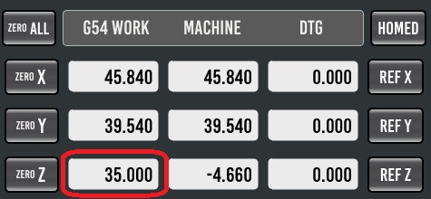

# Explanation of using the tool length probe subroutine for Probe Basic from TooTall18T .
Version 6.0.0 as of 23.02.2025  
https://github.com/TooTall18T/tool_length_probe

> [!IMPORTANT]  
> Read the manual carfully.

> [!IMPORTANT]  
> Use the subroutines at your own risk!

> [!NOTE]  
> To read this document it would be better to use a Markdown editor or a plug in for your editor.

> [!NOTE]  
> The German version of this document is called "[anleitung.md](anleitung.md)" and it is in the same folder.

> [!NOTE]  
> Use version 4.0.1 of this routine for Probe Basic up to version 0.5.4-stable.
> Use version 5.0.0 for Probe Basic 0.6.0 or other GUIs.
> Starting with version 0.6.0-37.dev of Probe Basic or any other GUI, version 6.0.0 or higher of this routine is required.

---
## Contents
- Notes and Notices
- Installation
    - Installation script
    - Manual installation
- Set up
    - Main settings
- Flow of the routine
    - Further functions
- Further information

---
## Notes and Notices
> [!NOTE]  
> The routines were tested with LinuxCNC 2.9.3 and Probe Basic 0.6.0-37.dev .
> With other versions, there may be differences in the process.

> [!IMPORTANT]  
> The functions of the routine should be tested at reduced speed before using the routine in production.

> [!NOTE]  
> Specifications such as "**{spindel zero}**" are input fields in Probe Basic.   
> For other GUIs they are seen as variables. See below.

> [!NOTE]  
> Specifications such as "**[TOOL]**" are buttons or menus in Probe Basic.  
> For other GUIs they are seen as variables. See below.

> [!NOTE]  
> Specifications such as "**#<tool_min_dis>**" are variables from the routine. These only may have to be adjusted when using a other GUI then Probe Basic.
---
## Installation

### Installation script
> [!NOTE]  
>The script is only for installing the routines and the user tab for Probe Basic. For other GUIs or you don't want to use the script please see the "Manual installation" below.  

The installation script makes a backup of all files and folders that will be replaced or edited.  
During the process it will give a feedback what was completed or not possible.  
If a step was not possible, please do it by hand. A second run of the script will give the same result.  
The script will do the same changes as you can read under "Manual installation".  

Leave all files and folders in its downloaded folders.  
Change the mod of the installation file with: chmod 770 ./install.sh  
Start the installation with: ./install.sh  
Please do not start the script with "sh ./install.sh". The script is a "bash"-script, which is the standard in most cases.

The script need at first the path to the .ini-file of your machine. It will check if it can find the files and directories which are important and check there read and write permissins. If they cound not be found, it will brake up. When the check was successful, you will be asked whether the installation should be carried out.  
Type in : YES  
The install script will copy and modify all files including all options.  

### Manual installation
> [!NOTE]  
> Some points are exclusively for Probe Basic or other GUIs. If nothing is written there, it applies to all.

> [!IMPORTANT]  
> Back up files and folders that are exchanged and/or edited beforehand.

Only the "tool_touch_off.ngc" file and for Probe Basic the "(user_tab/)tool_length_probe" folder are required to use the measurement routine.
All other files are optional.

#### ini-file:
For Probe Basic:
Enter the following in the ".ini" under "[DISPLAY]". If not already available:  
USER_TABS_PATH = user_tabs/  
"user_tabs/" is the default folder. If you use another one use yours.

Enter or change value of the following in the ".ini" under "[EMCIO]":  
TOOL_CHANGE_AT_G30 = 0			(Prevent the machine from moving to the G30-position when using the M6-command.)  
TOOL_CHANGE_QUILL_UP = 0		(Prevent the machine from moving the z-axis to G53 Z0-position when using the M6-command.)  

Delete or comment out the following line in the ".ini" under "[EMCIO]", if available:  
TOOL_CHANGE_POSITION = ......

Enter the M-command remaps you want to use. See "Optional subroutines" below.  

#### Subroutines
Copy file(s) from subroutines into the folder that is entered in the ".ini" under "[RS274NGS]" "SUBROUTINE_PATH =" (subroutines).  
If not available enter this line unter "[RS274NGS]":  
SUBROUTINE_PATH = subroutines  
Explanation of the optinal subroutines see below.
  
  
#### var-file (for Probe Basic)
Enter the following parameters in the ".var" file, which is stored in the ".ini" under "[RS274NGS]" "PARAMETER_FILE":  
2949    0.000000  
2951    0.000000  
2952    0.000000  
2953    0.000000  
2954    0.000000  
2955    0.000000  
2956    0.000000  
2957    0.000000  
2958    0.000000  
2959    0.000000  
2960    0.000000  
2961    0.000000  
2962    0.000000  

> [!IMPORTANT]  
> All parameters must be in ascending order in the file.  
> If the parameters are not entered or entered in the wrong order, the parameters from the user interface cannot be stored as a backup.
> Should the parameters listed above already exist for other cases than this routine, a customized version must be created. Please let me know. 

#### yml-file (for Probe Basic)
Open the ".yml" file which is stored in the ".ini" under "[DISPLAY]" "CONFIG_FILE" and add under "settings" (include one tab befor):  
  
Adjust the path from the ".ini" file to "tool_length_probe.yml" if necessary.

Search for "provider: qtpyvcp.plugins.tool_table:ToolTable" and add "I" to the "columns" line:
>provider: qtpyvcp.plugins.tool_table:ToolTable  
>kwargs:  
>columns: TZDIR

### Optional subroutines:
- go_to_g30.ngc -- Probe Basic: The original Probe Basic routine moves all axis at the same time to the G30-position. The new routine moves the z-axis free and than to the x and y coordinate of the G30-position. After that the z-axis moves to its position.
> [!NOTE]  
> The G30-position can be used as tool change position. If this case is not wanted, set **[DISABLE CHANGE POS]**

- M600.ngc -- Subroutine for calling tool measurement automatic mode (with tool change) from the CNC program (e.g. M600 T1).  
Enter the following in the ".ini" under "[RS274NGS]":  
REMAP=M600 modalgroup=6 ngc=m600  
> [!IMPORTANT]  
> A remap of "M6" is not recomended. The M6-command is used on different parts of Probe Basic and maybe other GUIs and using a remap can leed to unforeseeable events.

- M601.ngc -- Subroutine for calling tool measurement manual mode (without tool change) from the CNC program or by using other GUIs.  
Enter the following in the ".ini" under "[RS274NGS]":  
REMAP=M601 modalgroup=6 ngc=m601  
> [!IMPORTANT]  
> A remap of "M6" is not recomended. The M6-command is used on different parts of Probe Basic and maybe other GUIs and using a remap can leed to unforeseeable events.

- M300.ngc -- Subroutine to start a tool spindle without feedback. After the spindle has started, the CNC program pauses for an adjustable time (P4.0 = 4s). The time will be set in the routine.  
Enter the following in the ".ini" under "[RS274NGS]":  
REMAP=M300 modalgroup=7 ngc=m300  

- M500.ngc -- Subroutine to stop a tool spindle without feedback. If the spindle was on, the CNC program pauses for an adjustable time (P4.0 = 4s). The time will be set in the routine.  
Enter the following in the ".ini" under "[RS274NGS]":  
REMAP=M500 modalgroup=7 ngc=m500  

---
## Set up

### Main settings

> [!IMPORTANT]  
> For other GUIs fill the parameters inside the routine. Overwrite **all** HAL-pins (#<_hal[qtpyvcp.tlp.*****]>).

0. Other GUI: open the "tool_touch_off.ngc" subroutine with an editor.
1. Start LinuxCNC and make a reference.
2. Take out the tool.
3. Switch to tool "0".
4. Reset the workpiece coordinate system (G5X = G53).
5. Center the spindle over the tool setter.  
6. Position the spindle nose slightly above the trigger point of the tool setter.  
  
7. Probe Basic: Push **[SET TOOL SETTER POS]** under **[TOOL SETTER]** the coordinates will be shown above.  
    Other GUI: enter the actual coordinates to the three "**#<tool_setter_?_coords>**" parameters.
8. Set the z-axis to zero.
9. Move the z-axis up. Choose a distance that the longest tool has some space to the tool setter. This position is the starting position for new tools. Write the z-position from the current coordinate system  
(for Probe basic:) into **[TOOL SETTER]** **{spindle zero}** or press **[SET SPINDLE ZERO]**.  
(for other GUI:) into **#<spindle_zero_height>**.
  
  

For Probe Basic under **[TOOL SETTER]** fill in the following parameters:  
For other GUIs fill the parameters inside the routine. Overwrite **all** HAL-pins (#<_hal[qtpyvcp.tlp.*****]>)
| Parameter | Description  |
| -------  | -----  |
| ` MAIN ` |
| spindle zero  | Minimum distance between spindle and tool setter for new tools. |
| z max travel  | Maximum distance travelled by the Z-axis during the measurement of a known tool. Value should be greater than **{tool min dis}**. See picture below. |
| tool min dist | Distance between tool setter and old tool length. Only used in connection with tool table. Should be smaller then **{z max travel}**. See picture below.|
| retract dist  | Distance that the Z-axis moves up after the first touch before the second touch takes place. A value must be entered, regardless of whether the slow measurement takes place or not. |
| xy max travel | Is not used. |
| fast probe fr  | Speed in units/min for the first probe.  |
| slow probe fr  | Speed in units/min for the second probing. If the value is 0, only the first probing is carried out.  |
| traverse fr | Speed in units/min for fast movements of the routine. |
| ` OPTIONAL ` |
| USE TOOL TABLE | If the tool table is used and a known tool (length >0) will be measured, the tool will be positioned lower. |
| GO BACK TO START POS  | If "on" the machine drives back to the position where the routine was started during automatic measurement.|
| BRAKE AFTER SAME TOOL  | After a tool change to the same tool, the process can be paused with "M00"(1) or "M01"(2) See "Case 2.1 and 2.2". |
| BRAKE AFTER CHANGE TOOL | After a tool change to an other tool, the process can be paused with "M00"(1) or "M01"(2) See "Case 2.1 and 2.2"|
| add reps | Number of extra repetitions. If fast probe failed, the machine moves back to the tool change position and the tool can be readjusted. |
| LAST TRY | If the last probing failed the machine do a probing without the tool table. |
| spindle stop m  | M-code number to stop the spindle. Default 5 (M5), optional 500 (M500/m500.ngc). |
| TOOL DIAM PROBE | Not in use. |
| DEBUG MODE  | The debug mode for troubleshooting. File "logfile.txt" in the config folder of the machine. The file is overwritten each time. |
| DISABLE CHANGE POS | Disables the tool change position at the G30-coordinate. Tool will be changed above the tool setter. |
| SET TOOL CHANGE POS | For Probe Basic: Move the machine to its tool change position and click the button to store this position (G30).  
| | Other GUI: Move the machine to its tool change position and type in (MDI) "G30.1" to store this position. |
| tool offset direction | For measuring tools with larger diameter. Select a direction for the offset. "fnt angle" in tool table will be used as offset in percent. |
|  | For other GUI: one of the "**#<tool_offset_XXXX>**" needs to be "1" the others "0". |
| ` OPTION: TOOL EDGE-FINDER ` | In case the 3D probe need to be measured at a reference surface. |
| T no. (#<finder_number>) | Tool number of the edge-finder. If this tool will be measured the edge-finder probe it self at the reference surface below. |
| z offset | Difference between tool touch button and reference surface. In the axial direction. "-" = lower then tool setter, "+" = higher then tool setter. |
| SET 3D PROBE POS | For Probe Basic: Move the machine in X and Y to the reference surface and click the button to store this position. |
|  | For other GUI: Move the machine in X and Y to the reference surface and write down the machine coordinates to **#<finder_touch_x_coords>** and **#<finder_touch_y_coords>**. |

  

> [!IMPORTANT]  
> During the first measurements, the machine speed should be reduced in order not to damage anything in the event of incorrect settings.

> [!NOTE]  
> The texts of the message and warning windows can be changed inside the "tool_touch_off.ngc" file into German.
> In case search for "(DEBUG", and "(ABORT" and switch the semicolon ";". ))

---
## Flow of the routine

### 1 Sequence of the sub-routine for manual measurement via **[TOUCH OFF CURRENT TOOL]** or M601
When called, the subroutine differentiates between two cases: new tool (length <=0mm), known tool (length >0mm) .  

#### Case 1.1 and 1.2:  
The Z-axis moves up to the machine zero point, if necessary switches off the spindle (stop function selectable via **{spindle stop m}**) and then moves to the tool setter position.  
The option **[USE TOOL TABLE]** makes the measurement of shorter known tools faster (case 1.2), becouse of the lower positioning. If the tool table is not used, the machine always makes one "remeasurement" (case 1.1).  
Proceeding to case 1.1 or 1.2.

#### Case 1.1 new tool (length <=0mm):  
The Z-axis moves at the **{traverse fr}** speed to the height above the tool setter, which is defined via **{spindle zero}**.  
This value must be greater than the longest tool length to be expected, but less than the maximum way between tool setter and z-zero.  
The Z-axis then moves down at the **{fast probe fr}** speed until the tool setter switches or the Z-axis has covered the **{spindle zero}** distance.  
The latter leads to an error message: "Tool length offset probe failed!"  
When the button has switched, the Z-axis moves up by the **{retract dist}** value.  
If a speed is defined for **{slow probe fr}** (>0), the machine approaches the probe again at this speed. If no speed is defined, this step is skipped.  
The Z-axis then moves to the machine zero point.  
The machine now stops during manual measurement.

#### Case 1.2 known tool (length >0mm):  
If **[USE TOOL TABLE]** is "on", this sequence is used for known tools (length >0mm). Otherwise case 1.1 is used.  
Starting from the old tool length, the Z axis moves the tool at the **{traverse fr}** speed as high over the tool setter as defined under **{tool min dis}**.  
**{tool min dis}** should not be defined too small in order to be able to absorb differences when inserting the tool.  
The Z-axis then moves down at the **{fast probe fr}** speed until the tool setter switches or the Z-axis has covered the **{z max travel}** distance.  
The latter leads to an error message: "Tool length offset probe failed!"  
**{z max travel}** should not be chosen too large, otherwise the spindle can move onto the tool setter.  
If the tool setter has switched, the Z-axis moves up by the **{retract dist}** value.  
If a speed is defined for **{slow probe fr}** (>0), the machine moves the probe again at this speed. If no speed is defined, this step is skipped.  
The Z-axis then moves to the machine zero point.  
The machine now stops during manual measurement.  

### 2 Sequence of the subroutine when measuring from the CNC program (M600 Tn)
When called, the subroutine differentiates between four cases: new tool (length <=0mm), known tool (length >0mm), same tool and change to "T0".

#### Case 2.1 and 2.2:  
The measurement of new and known tools works the same way in the measurement that is started by the CNC program. See "Case 1.1" and "Case 1.2" above.  
However, the machine moves to the tool change position (G30 or above the tool setter) and ask for the new tool before moving to the tool setter. See also "change position".  
In addition, you can use **[GO BACK TO START POS]** to select that the machine, after the measurement, returns to the point where the routine was called. So you don't have to program the return path from the tool setter in the CNC program.  
**[BRAKE AFTER TOOL CHANGE]** can be used to pause the CNC program after the measuring of a tool. With **[GO BACK TO START POS]** it will pause at the called position otherwise above the tool setter.
"no"(0) does not pause.  
"M00"(1) pauses using "M00" command. Continue driving by pressing **[CYCLE START]**  
"M01"(2) makes a break using the "M01" command if **[M01 BREAK]** is also active in Probe Basic. Continue driving by pressing **[CYCLE START]**.

> [!WARNING]  
> The subroutine does not restart the spindle!

#### Case 2.3 same tool:  
Is the selected tool already in the machine. The message "Same tool" is output. The spindle would not be stopped.  
**[BRAKE AFTER SAME TOOL]** can be used to select whether the machine waits at this point before the CNC program continues to run.  
"no"(0) does not pause.  
"M00"(1) pauses using "M00" command. Continue driving by pressing **[CYCLE START]**  
"M01"(1) makes a break using the "M01" command if **[M01 BREAK]** is also active in Probe Basic. Continue driving by pressing **[CYCLE START]**.

#### Case 2.4 Change to T0:  
> [!WARNING]  
> A change at the end of the CNC program using "M600 T0" can cause LinuxCNC to switch from G43 to G49 if the program aborts!  
> If the program is restarted, it may not switch back to G43. Danger of collision!  
> The case only serves to ensure that a measurement is not accidentally started with tool "0".

### Further functions

#### Debug mode
The debug mode writes the "logfile.txt" file inside the configurations directory. In this file some machine and subroutines parameter will be saved to help with trouble shooting. The file will be overwritten every time.   

#### Change position
The tool change position (G30) can be set with **[TOOL SETTER]** **[SET TOOL CHANGE POS]** / "G30.1".  
To do this, move the machine to the desired position and press **[SET TOOL CHANGE POS]** / type in "G30.1". This position can be changed at any time if needed. To use this position for the routine **[DISABLE CHANGE POS]** must be switched "off".  
If this function will be used, the machine moves to the G30 X-, Y- and Z-coordinate in case of a measurement started with "M600 Tn" and asks there for the tool change.  
After that the machine moves to the tool setter position.  
When the tool table is used and the additional repetitions (**{add reps}**) is set to a min. of "1", the machine moves to this position after the fast measurement failed. This happens at the manual and automatic measurement.  
This will happen to readust the tool.  
If the option "last try" will be used, the machine doesn't move to this position at the last try of measurement.

#### Additional repetitions
If the measurement with an active tool table fails during the fast measurement due to a tool that has been installed too short. Additional repetitions can be added using this parameter. After a failure, the tool can be readjusted if necessary.

#### Last try
If the tool table is used (**[USE TOOL TABLE]** is "on") and measurements have failed except for the last attempt, a "new measurement" can be carried out using this function.

#### Tool diameter offset
For tools with a larger diameter, this function can be used to create a center offset. The direction of this offset can be set by **[TOOL SETTER]** "tool offset direction" / **#<tool_offset_XXXX>**. The offset value is set individually at the tool table "fnt angle" value in percent. At a 10mm tool a "fnt angle" value of "50" leads to an offset of 5mm .  

#### Edge-finder
If it is not possible to measure a 3D/edge-finder using the tool setter. An alternative survey position can be defined for this. The height difference between the measurement position and the tool setter must be determined and entered in **{z offset}** / **#<finder_z_offset>**. The sign indicates the difference in the axial direction. "-" = lower than tool setter, "+" = higher than tool setter.

---
## Further information:  
> [!NOTE]  
> The "xy max travel", "tool diam probe" and "tool diam offset" parameters are not used in the routine.
